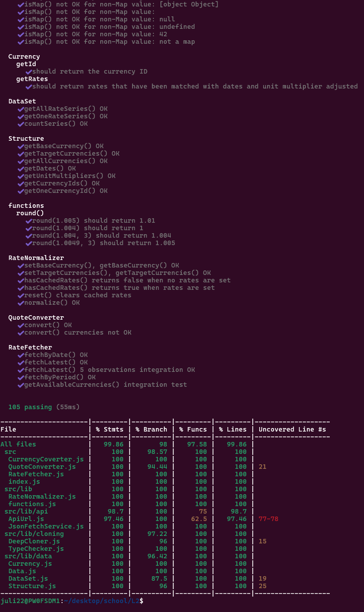

# Test report

All public metods are tested with unittests using mocha/chai testing frameword combined with sinon for mocking, and have 100% coverage calculated by C8.  

After cloning repo, from the root directory run:  

```npm install```

then

```npm run test```

## Test specification + coverage report





The testsuits can be found in the ./test and .test/lib directories
