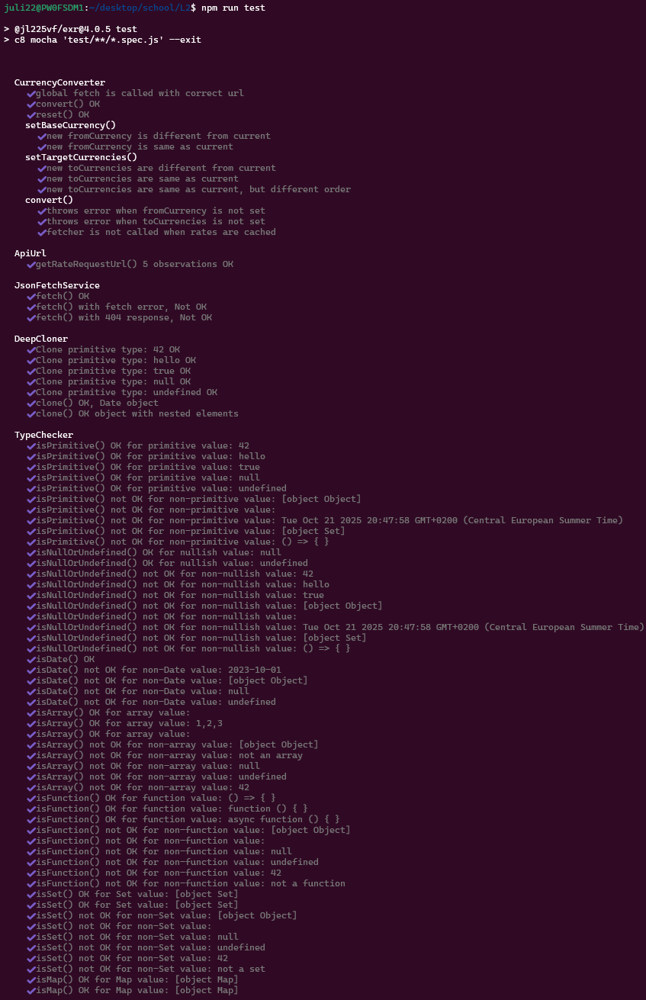

# Testrapport

Alla publika metoder är testade med enhetstester med hjälp av ramverk mocha/chai samt sinon modulen för mockning.

Koden har en hög kodteckning på över 97%, beräknat med hjälp av C8.   

Efter att du klonat ner repot, installera beroenden (testramverk + eslint):  

```bash
npm install
```

Kör därefter testerna med:

```bash
npm run test
```

## Test specifikation och kodtäckningsrapport




Testsviterna finns i ./test respektive .test/lib katalogerna
